# 🤖 Multi-Agent AI Tutor System

A smart AI tutoring system with specialized agents for different subjects, powered by Google Gemini. The system uses a coordinator agent that intelligently routes questions to specialist agents (Math, Physics) which can utilize tools like equation solvers and formula lookups to provide accurate, educational responses.

## 🧠 System Architecture

```mermaid
graph TD
    User["👤 User"] -->|"Asks Question"| API["🌐 API Endpoint"];
    API -->|"Routes Request"| Tutor["🎓 Tutor Agent\n(Coordinator)"];
    Tutor -->|"Routes Math\nQuestions"| Math["🔢 Math Agent"];
    Tutor -->|"Routes Physics\nQuestions"| Physics["⚛️ Physics Agent"];
    Math -->|"Uses"| EqSolver["⚖️ Equation Solver"];
    Math -->|"Uses"| MathFormula["📚 Formula Lookup"];
    Physics -->|"Uses"| PhysicsFormula["📊 Formula Lookup"];
    Math -->|"Responds"| API;
    Physics -->|"Responds"| API;
    API -->|"Delivers Answer"| User;
```



## ✨ Key Features

- **🧠 Intelligent Routing**: Automatically directs questions to the right specialist
- **🔧 Tool Integration**: Uses specialized tools for solving equations and looking up formulas
- **🚀 Fast & Efficient**: Optimized for quick responses and low latency
- **🌐 Production Ready**: Deployed on Vercel for reliable access

## 🚀 Quick Setup

### Local Development

```bash
# Clone and setup
git clone https://github.com/yourusername/MultiAgentTutor.git
cd MultiAgentTutor
pip install -r requirements.txt

# Configure environment
cp .env.example .env
# Add your GEMINI_API_KEY to .env

# Run the server
uvicorn app.main:app --reload --port 8090
```

### 🌐 Deployment

The system is deployed on Vercel at: https://multi-agent-tutor.vercel.app

Key environment variables:
- `GEMINI_API_KEY`: Your Google Gemini API key

## 🔌 API Reference

### Main Endpoints

| Endpoint | Method | Description |
|----------|--------|-------------|
| `/ask` | POST | Main endpoint - routes to appropriate specialist |
| `/ask/{agent_type}` | POST | Direct access to specific agent (math/physics) |
| `/agents` | GET | List available specialist agents |
| `/health` | GET | System health check |

### Example Usage

```bash
# Ask any question (auto-routing)
curl -X POST "https://multi-agent-tutor.vercel.app/ask" \
  -H "Content-Type: application/json" \
  -d '{"query": "Solve 2x + 5 = 15"}'

# Ask math specialist directly
curl -X POST "https://multi-agent-tutor.vercel.app/ask/math" \
  -H "Content-Type: application/json" \
  -d '{"query": "What is the quadratic formula?"}'

# Ask physics specialist directly
curl -X POST "https://multi-agent-tutor.vercel.app/ask/physics" \
  -H "Content-Type: application/json" \
  -d '{"query": "What is the formula for kinetic energy?"}'
```

## 🧠 User Journey


## 🧩 System Components

### Intelligent Agents

- **🎓 Tutor Agent**: Analyzes questions and routes to specialists
- **🔢 Math Agent**: Handles algebra, calculus, and mathematical concepts
- **⚛️ Physics Agent**: Specializes in mechanics, electricity, and physics concepts

### Specialized Tools

- **⚖️ Equation Solver**: Solves algebraic equations step-by-step
- **📚 Formula Lookup**: Retrieves mathematical and physics formulas

### Technical Implementation

- Built using Python and FastAPI for high-performance API handling
- Powered by Google Gemini for intelligent reasoning
- Deployed on Vercel for reliable access
- Implements tool-augmented agents based on ADK principles

## 💡 Usage Examples

### Math Problems

**Input**: "Solve the equation 3x + 7 = 22"

**Response**:
```
To solve 3x + 7 = 22:
1. Subtract 7 from both sides: 3x = 15
2. Divide both sides by 3: x = 5

Therefore, x = 5 is the solution.
```

### Physics Concepts

**Input**: "What is the formula for kinetic energy?"

**Response**:
```
The formula for kinetic energy is:

KE = ½mv²

Where:
- KE is kinetic energy in Joules (J)
- m is mass in kilograms (kg)
- v is velocity in meters per second (m/s)

This formula shows that kinetic energy increases with mass, but increases with the square of velocity.
```

## 🧪 Testing and Verification

Test the deployed application with these commands:

```bash
# Health check
curl https://multi-agent-tutor.vercel.app/health

# Math question
curl -X POST "https://multi-agent-tutor.vercel.app/ask" \
  -H "Content-Type: application/json" \
  -d '{"query": "Solve x^2 - 9 = 0"}'

# Physics question
curl -X POST "https://multi-agent-tutor.vercel.app/ask" \
  -H "Content-Type: application/json" \
  -d '{"query": "What is Newton's second law?"}'
```

---

Built with Google Gemini 2.0 Flash and FastAPI
